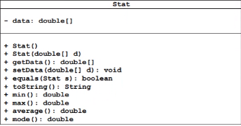

# Stat - Classes, Objects and Methods

## Introduction

In this lab you will continue to practice defining your own classes, in this case implementing a class called **Stat** that is described using a UML class diagram. A class diagram describes the fields (variables) and methods defined for a class. It also specifies the parameters and return types for methods, and it describes whether particular fields and methods are public or private. Collectively, the fields and methods of a class are called the *members* of the class, and the public members define an interface for the class. It is through this interface that interaction with the class and its instances is made possible.

UML is widely used in software engineering to specify the structure and behavior of software systems. We will only deal with a single UML class diagram in this lab, but UML allows one to visually represent large numbers of classes and other structures as well as how they interrelate (for instance, that one class is a specialization of another). For large software projects, formalisms such as UML are essential if one is to cope with the complexity of the software system.

The **Stat** class stores an array of **double** values called data. As indicated by the class diagram, you will need to implement public methods to compute the **min**, **max**, **mode**, and **average** of these values. You will also implement methods to "get" and "set" the calues held by **data**. Importantly, **data** should be a private instance variable, meaning that each instace of the **Stat** class should have its own copy of the **data** variable (each object would store different arrays of **double** values).

As indicated in the UML diagram, **data** has type **double[]**. This is a reference type, meaning that **data** will store a reference to the memory location where that array is stored. That is, **data** will not store the array itself.

We want to ensure that each distinct instance of the **Stat** class uses its own array of doubles, and in order to do that, you should define **getData()** so that it creates a copy of the **data** array and returns a reference to the copy and not a reference to the original. Otherwise, it would be possible to modify the contents of the **data** array without going through the methods of the **Stat** class (and this is considered bad design). Similarly, **setData(double[] d)** should create a copy of the array **d** and assign to **data** a reference to the copy.

## Instructions

Use the UML diagram and method descriptions below to create your **Stat** class.

Observe that **data** should be private; you should define your class so that **data** (and its values) can only be altered through **getData** and **setData**.

### Method Descriptions:

- `Stat()`: The default constructor for **Stat**. It should create a double array having a single element 0.0.

- `Stat(double[] d)`: Constructs a **Stat** object using the values held in **d**. The constructor should create a double array of the same length as **d** holding copies of the values of **d**. A reference to this new array should be assigned to **data**.

- `getData()`: This is an accessor (*get* or *getter*) method used to retrieve the values of **data**. This method should not return a reference to **data**. Instread, it should create a new array containing exactly the values contained in **data**, and then return a referece to this new array.

- `setData(double[] d)`: This is a mutator (*set* or *setter*) method used to set the values of the data array. The method should create a new array containing exactly the elements of **d** and assign to **data** a reference to this new array (that is, the method should not simply assign **d** to **data**).

- `equals(Stat s)`: Returns the **boolean** value **true** if the **data** obects of both the calling Stat object and the passed Stat object **s** have the same values (and in the same order). Otherwise, it returns **false**.

- `toString()`: Returns a **String** representation of the data elements stored in the **Stat** object. Use the samples listed below as guidelines for formatting.

- `min()`: Returns the minimum of the **data** array.

- `max()`: Returns the maximum of the **data** array.

- `average()`: Returns the average of the **data** array. The average is defined to be a double value that returns the mean value of a given array of numbers.

- `mode()`: The mode is the value that occurs most frequently in a collection of values. In the Stat class, if one value occurs more frequently in a **data** than all others, then `mode()` should return this calue. Otherwise, `mode()` should return **Double.NaN** indicating that no unique value exists.

